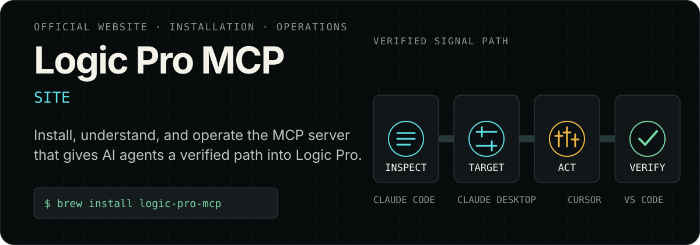
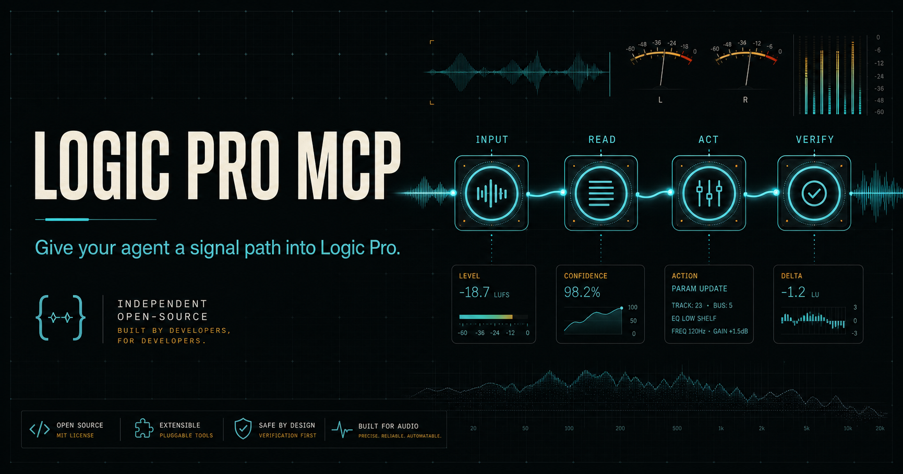

<p align="center">
  
</p>

<p align="center">
  <strong>The official website and installation guide for Logic Pro MCP.</strong><br>
  Give Claude, Cursor, VS Code, and custom AI agents a verified path into Logic Pro on macOS.
</p>

<p align="center">
  <a href="https://logicpromcp.com/"><strong>Open the website</strong></a>
  ·
  <a href="https://github.com/MongLong0214/logic-pro-mcp">MCP server source</a>
  ·
  <a href="https://github.com/MongLong0214/logic-pro-mcp/blob/main/docs/SETUP.md">Setup guide</a>
</p>

> This repository contains the website. Releases, product documentation, issues, and contributions live in [`MongLong0214/logic-pro-mcp`](https://github.com/MongLong0214/logic-pro-mcp).

## See the product

<p align="center">
  <a href="https://logicpromcp.com/">
    
  </a>
</p>

Logic Pro MCP is a local Model Context Protocol server for composing, inspecting, controlling, and verifying work in Logic Pro. The site turns the source documentation into practical installation paths and evidence-backed workflows.

The Session Desk redesign uses the published **v3.18.0** documentation (reviewed October 5, 2026). Its archived demo plays only on request, with a spectrum derived from the actual recording. The interactive workflow desk explains A/B/C outcomes without pretending to connect to a user's Mac; the installation desk switches between the four real client configurations. Native View Transitions and scroll-linked CSS are progressive enhancements, with reduced-motion and keyboard alternatives.

## Start here

Install the server and run its readiness checks:

```bash
brew install logic-pro-mcp
LogicProMCP doctor
```

Then use the guide for the application that will launch it:

- [Claude Code](https://logicpromcp.com/install/claude-code)
- [Claude Desktop](https://logicpromcp.com/install/claude-desktop)
- [Cursor](https://logicpromcp.com/install/cursor)
- [VS Code](https://logicpromcp.com/install/vscode)

## What the site explains

- **Install and recover** — client-specific registration, macOS permissions, Doctor checks, and failure recovery.
- **Compose MIDI** — create musical material while keeping send-only readback limits explicit.
- **Automate the mixer** — use guarded writes only where project identity and parameter readback exist.
- **Plan and verify exports** — audit, plan, run, resume, and inspect Logic-written audio artifacts.
- **Understand the boundary** — distinguish verified state from uncertainty instead of treating a plausible response as proof.

The operating pattern is deliberately simple:

```text
inspect → name the target → act behind the gate → verify independently
```

Read the [complete Logic Pro MCP guide](https://logicpromcp.com/guides/logic-pro-mcp), the [safe Claude control workflow](https://logicpromcp.com/guides/control-logic-pro-with-claude), or jump to a use case:

- [Compose MIDI](https://logicpromcp.com/use-cases/compose-midi)
- [Mixer automation](https://logicpromcp.com/use-cases/mixer-automation)
- [Batch export](https://logicpromcp.com/use-cases/batch-export)

## Trust and discovery

Product claims are pinned to reviewed source excerpts under [`docs/evidence/`](docs/evidence/). The verification suite checks their hashes, expiry windows, and rendered coverage across UI copy, metadata, JSON-LD, and [`llms.txt`](https://logicpromcp.com/llms.txt).

The site also publishes canonical metadata, [`robots.txt`](https://logicpromcp.com/robots.txt), [`sitemap.xml`](https://logicpromcp.com/sitemap.xml), and structured data for search and AI discovery. Its analytics contract has no collector, storage, identifiers, or network transport configured.

## Develop locally

Requires Node.js `>=22.13.0`.

```bash
npm install
npm run dev
```

Before publishing:

```bash
npm test
npm run typecheck
npm run lint
npm run verify:all
npm run qa:e2e
npm run qa:lighthouse
npm run audit:prod
```

The browser and Lighthouse suites use an isolated, exact-version QA environment so test-only packages do not enter the shipped dependency graph. See [`docs/qa.md`](docs/qa.md) for the full release matrix.

The player downloads its small same-origin recording only after activation and revokes its media object URL on unmount. `media-src 'self' blob:` permits this seekable local playback; script and connection policies remain unchanged. The original poster is retained alongside an optimized WebP delivery asset. No analytics collector, database, or new application dependency was added for the redesign.

## Deployment

The site is deployed with OpenAI Sites. `.openai/hosting.json` stores the Sites project identifier and optional resource bindings; hosted configuration and access policy remain managed by Sites.

## License

The website source is available under the [MIT License](LICENSE). Logic Pro MCP is independently licensed in its [product repository](https://github.com/MongLong0214/logic-pro-mcp/blob/main/LICENSE).
